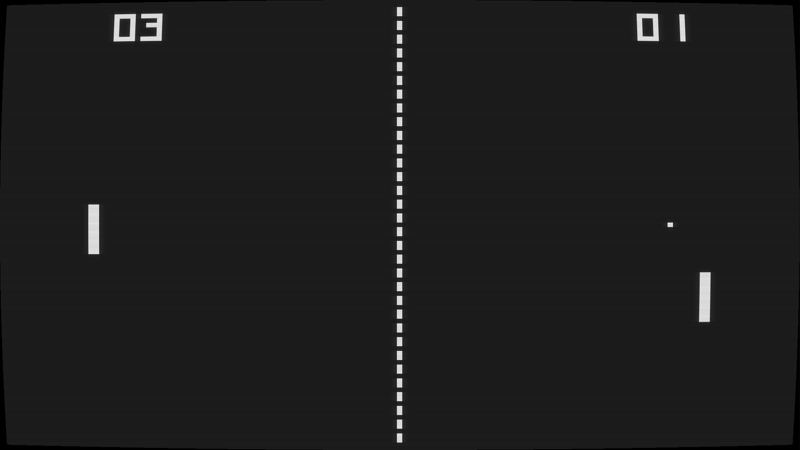

# Retro Pong

 We embarked on this project not because it was going to be easy, but because we **thought** it was going to be easy.

A processing.org & arduino implementation of the classic game "pong" using atari's [paddle controller](https://atari.com/products/cx30-paddle-controller-bundle), with a retro look.

## TL&DR

* get an Atari CX-30 [paddle controller](doc/images/atari-paddles.png), I got mine from an online retailer, no need to get atari's bundle if you don't have the console or don't want the cartriges.
* build the arduino [adapter](doc/controller.md)
* upload the arduino [sketch](src/arduino) to your arduino
* open the processing [sketch](src/processing) on your computer

Here's an animated gif of the gameplay, the conversion to gif makes it appear slow and full of crazy artifacts, for a better feel (including sound) you can check this [video](doc/video/gameplay.mp4) of the actual gameplay.

have fun playing and hack away!
