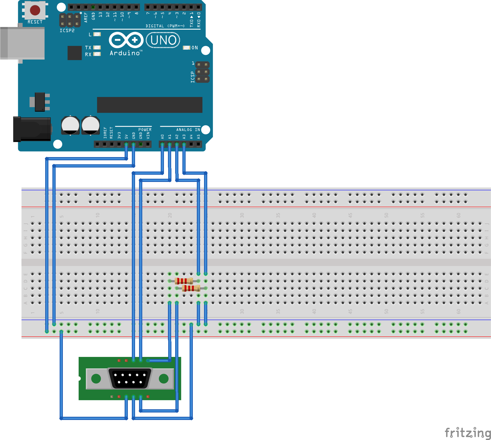

# Controller

Initially I thought I could use a usb/atari joystick converter for the game, however the paddles don't work with the converters I tried.  I did some research and found the following pinout diagram:

 

source: [forums.atariage.com](https://forums.atariage.com/topic/225470-the-atari-joystick-pinout-common-ground/) 

I assumed that the paddles are themselves variable resistors and that it would be an edifying experience to create an arduino project to read the joystick ourselves. 

## Bill Of Materials

* 1 x Atari CX30+ [Paddles](images/atari-paddles.png), available online.
* 1 x Arduino.
* 1 x Breadboard.
* 1 x DB9 male connector
* 2 x 2Kohm resistors (maybe other values will give better results) 
* Breadboard cables

## Breadboard diagram

## Arduino code

The code is in the [arduino](../src/arduino) folder of the project

Upload the code to your arduino, fire up the serial monitor and you should see sets of four comma separated values followed by a new line character coming out of the serial port.

The four values are:

* state of paddle A's button (0 -> not pressed, 1 -> pressed)
* position of paddle A (a value between 0 and 1023)*
* state of paddle B's button
* position of paddle B

Move the paddles, press the buttons and see how the values change.  A paddle all the way to the top should return something close to 1023*, paddle all the way to the bottom should return 0.  Buttons should work also although the game does not use them yet.

Once everything is working, make sure your arduino-ide is closed since it keeps the serial port open making it unavailable for the game.

\* there may be something wrong with the design, the maximum value I am getting is close to 870.

